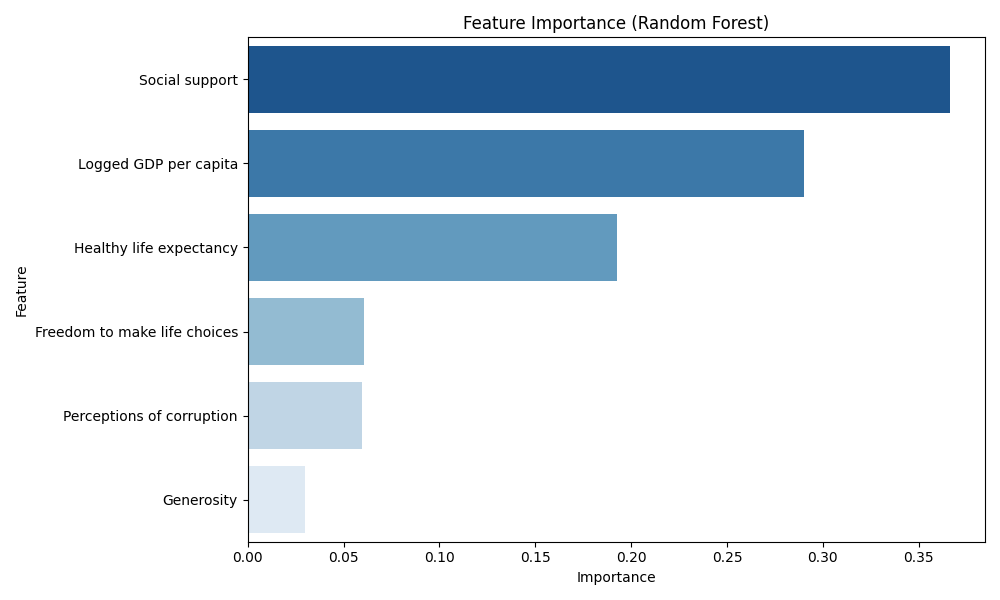

# 📊 Model Value Report

## 🔍 Model Overview
- **Model Type:** Random Forest Regressor
- **Dataset:** World Happiness Report 2021

## 📈 Performance Metrics
- **Mean Squared Error (MSE):** 0.3743
- **R-squared (R²):** 0.6372

## ⭐ Feature Importance
The following features were identified as the most influential in predicting
the happiness (ladder) score:

| Feature | Importance |
| :--- | :--- |
| Social support | 0.3662 |
| Logged GDP per capita | 0.2903 |
| Healthy life expectancy | 0.1926 |
| Freedom to make life choices | 0.0608 |
| Perceptions of corruption | 0.0599 |
| Generosity | 0.0301 |

